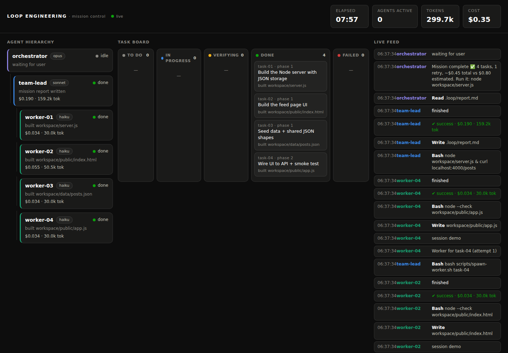

# Loop Engineering Demo

Minimalna hierarchia coding-agentów działająca przez API. OpenCode dostarcza narzędzia,
uprawnienia i sesje; modele wybierasz niezależnie dla każdej roli, np. przez OpenRouter.



```text
Human -> Orchestrator
              -> deterministic Node controller
                    -> Team Lead: plan
                    -> Workers: parallel implementation
                    -> Team Lead: verification/report
```

Controller, nie model, odpowiada za czekanie, retry, timeouty, budżet i statusy. Dzięki
temu Team Lead nie spala tokenów na `sleep`, polling ani ręczne pisanie JSON-a.
Każde wywołanie agenta dostaje świeżą sesję. Osobny, lokalny indeks modułów ogranicza
ponowne czytanie repozytorium i nie należy do protokołu `.loop`.

## Wymagania

- Node.js 18+
- [OpenCode](https://opencode.ai) 1.17+
- klucz API wybranego providera; przykłady poniżej używają OpenRoutera

## Konfiguracja

```bash
opencode auth login
opencode models openrouter
```

Wybierz OpenRouter podczas logowania, a następnie ustaw pełne identyfikatory
`provider/model` w `loop.config.json`:

```json
{
  "models": {
    "orchestrator": {
      "id": "openrouter/z-ai/glm-5.2",
      "variant": "max"
    },
    "teamLead": {
      "id": "openrouter/openai/gpt-5.6-luna",
      "variant": "max"
    },
    "worker": {
      "id": "openrouter/xiaomi/mimo-v2.5-pro"
    }
  },
  "maxCostUsd": 3,
  "agentTimeoutMs": 600000,
  "workerRetries": 1
}
```

Wartości można nadpisać bez edycji pliku:

```bash
export LOOP_ORCHESTRATOR_MODEL=openrouter/<model-id>
export LOOP_TEAM_LEAD_MODEL=openrouter/<model-id>
export LOOP_WORKER_MODEL=openrouter/<model-id>
export LOOP_TEAM_LEAD_VARIANT=max
```

## Start

```bash
node scripts/open.js
```

W sesji napisz `start`. Orchestrator uruchomi dashboard, zbierze wymagania, pokaże
limit kosztu i dopiero po zatwierdzeniu uruchomi `node scripts/start-mission.js`.

Dashboard: `http://127.0.0.1:3333`

## Statusy

- Orchestrator: `interviewing`, `awaiting_approval`, `launching`, `monitoring`,
  `verifying`, `reporting`, `done`, `failed`.
- Team Lead: `starting`, `planning`, `dispatching`, `waiting_workers`,
  `reviewing_results`, `integrating`, `verifying`, `reporting`, `done`, `failed`.
- Worker: `queued`, `running`, `done`, `failed`.

Workerzy nie generują opisowych statusów. Dashboard pokazuje ich zwykłe tool events.

## Indeks Kodu

Agenci przebudowują deterministyczny graf importów przed szerokim przeszukiwaniem.
Można go też odpytywać ręcznie:

```bash
node scripts/code-index.js build
node scripts/code-index.js summary
node scripts/code-index.js neighbors scripts/controller.js both 2
node scripts/code-index.js impact scripts/status.js
node scripts/code-index.js path scripts/open.js scripts/eventlog.js
```

Artefakt `.code-index/graph.json` jest ignorowany przez Git i pozostaje całkowicie poza
`.loop`. Indeks obejmuje relacje importów; dokładne symbole nadal wyszukuje się zwykłym
`grep`/`read`.

## Testy I Demo

```bash
node --test
node dashboard/server.js
DEMO_SPEED=5 node scripts/demo.js
```

Testy i `demo.js` nie wykonują płatnych wywołań API. Testują między innymi crash,
timeout, retry, atomowe statusy i reconnect SSE bez podwajania kosztu.

## Pliki

| Element | Rola |
|---|---|
| `scripts/controller.js` | deterministyczne fazy, retry, timeout i budżet |
| `scripts/agent-runner.js` | bezpieczne `opencode run --format json` bez shella |
| `scripts/code-index.js` | osobny, lokalny graf importów dla świeżych sesji |
| `scripts/status.js` | walidowane, atomowe statusy |
| `agents/*.md` | prompty Team Leada i Workera |
| `opencode.json` | narzędzia i permissions ról |
| `loop.config.json` | modele i limity runtime |
| `.loop/` | mission, tasks, statuses, events i report |
| `dashboard/` | lokalny serwer SSE i UI |

## English

This is a minimal API-backed coding-agent hierarchy. OpenCode provides tools,
permissions and sessions; OpenRouter is the initial provider, and every role accepts a
full configurable `provider/model` ID.

Run `opencode auth login`, configure `loop.config.json`, then launch:

```bash
node scripts/open.js
```

Type `start`. The Orchestrator interviews you and requires explicit budget approval.
The deterministic controller starts a fresh Team Lead for planning, runs fresh Workers
in parallel, waits without model turns, and starts another fresh Team Lead for
verification. Agents query the standalone `.code-index/graph.json` module graph before
broad repository discovery; the index is not part of `.loop` or controller lifecycle.

Use `node --test` for the credential-free regression suite, or run the zero-cost UI
replay with `node dashboard/server.js` and `DEMO_SPEED=5 node scripts/demo.js`.

## PetBooksy App (workspace/)

The `workspace/` directory contains a Next.js pet-services booking app with a
SQLite (libsql/Drizzle) backend. It is the deliverable produced by sequential
tasks and has no paid services, real auth, online payment, or background
processes built in.

### Limitations

- **Pay at venue** — bookings store `paymentStatus: "pay_at_venue"`; no payment
  gateway or card capture is involved.
- **Seeded session** — user identity is read from the `petbooksy-user` cookie or
  `x-petbooksy-user` header, defaulting to the seeded owner (`owner-1`). No
  sign-up, login, or token flow exists.
- **Out of scope** — notifications, admin dashboards, analytics, deployment
  configuration, and CI pipelines are not implemented.

### Local Setup

```bash
cd workspace
npm install          # install Next.js + Drizzle dependencies
npm run seed         # create and populate data/petbooksy.db
npm run dev          # start dev server on http://localhost:3000
```

### Smoke Test

Run the acceptance smoke check while the dev server is active:

```bash
# Terminal 1
cd workspace && npm run dev

# Terminal 2
node tests/petbooksy-smoke.mjs
```

Override the target with `BASE_URL`:

```bash
BASE_URL=http://localhost:3000 node tests/petbooksy-smoke.mjs
```

The script exercises search, profile, booking, review, and messaging through
the JSON API — it exits non-zero on any unexpected status, malformed response,
or failed persistence round trip.
